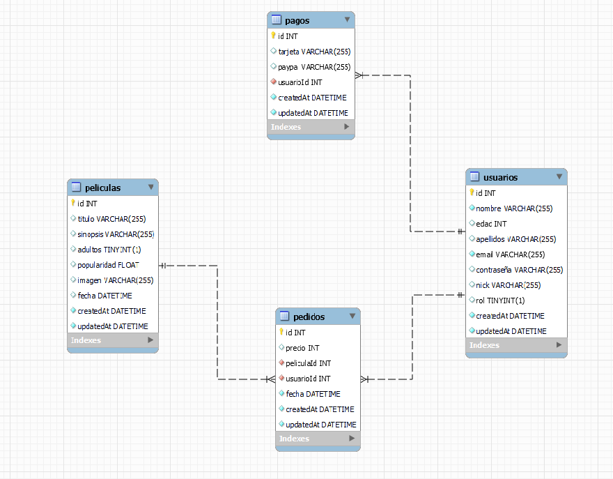

# Proyecto VideoClub API

## Proyecto realizado para GeeksHubs Academy, en el que se solicita realizar la API de un videoclub.
Nos indican que el proyecto constará de 3 tablas: películas, usuarios y pedidos. Los usuarios podrán hacer un pedido de una sola película. Los usuarios podrán tener varios pedidos o ninguno, pero en un pedido solo podrá aparecer un usuario (1:N). Las películas podrán aparecer en varios pedidos o en ninguno, pero en un pedido solo podrá aparece una película (1:N). La relación entre tablas sería la siguiente:
***

***

## Pre-requisitos del proyecto para hacerlo funcionar en tu equipo local:

* Instalar **Nodejs** en nuestro equipo, descargándolo de su página oficial
https://nodejs.org/

* Clonar el proyecto en nuestro equipo con git:
```
$git clone 'url-del-repositorio'
```

* Instalar todas las dependecias con el siguiente comando:
```
npm install
```

* Arrancamos el servidor con el siguiente comando:
```
npm start
```

## Creación de la base de datos

Tras modificar el archivo /config/config.json con los datos de nuestro servidor mysql (nombre, contraseña, database y host), ejecutaremos los siguientes comandos:
* **Creación de la base de datos**:
```
sequelize db:create
```
* **Creación de las tablas**:
```
sequelize db:migrate
```
* **Creación de los registros**:
```
sequelize db:seed:all
```

## Uso de la API

Usar la colección de postman, en donde están todos los endpoints para poder manipular la base de datos.


## Tecnologías utilizadas en el proyecto:

* **express**: Instalamos express en nuestro proyecto:
```
npm install express
```
* **nodemon**: Instalamos nodemon en nuestro proyecto. También añadimos en nuestro **package.json** un script para poder ejecutarlo:
```
npm install nodemon
```
```
//AÑADIDO EN PACKAGE.JSON
"dev": "nodemon index.js"
```
```
//EJECUTAMOS EN TERMINAL
npm run dev
```
* **morgan**: Instalamos morgan en nuestro proyecto, para poder mostrar mensajes por terminal al realizar peticiones al servidor.
```
npm install morgan
```
* **winston**: Instalamos winston en nuestro proyecto, creando la posibilidad de generar logs y guardarlos.
```
npm install wiston
```
* **sequelize**: Instalamos sequelize en nuestro proyecto, haciendo que podamos conectarnos y manipular la base de datos.
```
npm install sequelize-cli -g
npm install --save sequelize mysql2 sequelize-cli
sequelize init
```
* **cors**: Instalamos cors en nuestro proyecto, para tener un control de acceso a nuestra API:
```
npm install cors
```
* **jsonwebtoken**: Instalamos jsonwebtoken en nuestro proyecto para gestionar uso de tokens:
```
npm install jsonwebtoken
```
* **bcrypt**: Instalamos bcrypt en nuestro proyecto para encriptar contraseñas:
```
npm install bcrypt
```

## Explicación de la estructura del proyecto

Usamos el modelo vista-controlador para estructurar el proyecto. **Creamos un CRUD básico**. En el proyecto existirá la siguiente estructura:

* **index.js**: Este es el archivo principal. En este archivo se llama al archivo de las rutas, se gestiona la creación de logs, se gestiona la ruta inicial (/) y se arranca el servidor.

* **config**
    * **config.json**: En este archivo se gestiona la configuración para conectar con la base de datos. Se crea de manera automática con **sequelize**.
    * **auth.js**: En este archivo se gestiona la clave con la que se cifra la password a encriptar, la duración del token y la cantidad de veces que se encripta la password.

* **middlewares**
    * **auth.js**: En este archivo se gestiona la existencia y uso de los token para acceder a las zonas restringidas de la API. De aquí se obtiene el rol del usuario.


* **db.js**: En este archivo se gestiona el acceso a la base de datos.

* **router.js**: En este archivo se gestiona las diferentes vistas que puede tener la aplicación. Se creará una ruta por cada tabla de la base de datos a la que queramos acceder (películas, usuarios y pedidos).

* **views**
    * **PeliculaRouter.js**: En este archivo gestionamos la ruta /peliculas y los endpoints que apuntan a dicha ruta.
    * **UsuarioRouter.js**: En este archivo gestionamos la ruta /usuarios y los endpoints que apuntan a dicha ruta.
    * **PedidoRouter.js**: En este archivo gestionamos la ruta /pedidos y los endpoints que apuntan a dicha ruta.

* **controllers**
    * **PeliculaController.js**: En este archivo creamos las funciones de cada endpoint:
        * **getAll**: Obtenemos un listado de todas las películas.
        * **getById**: Obtenemos la película buscada por ID.
        * **getByTitulo**: Obtenemos un listado de las películas filtrado por el titulo de la película.
        * **delete**: Eliminamos una película por ID (securizado para que solo pueda acceder un administrador).
    * **UsuarioController.js**: En este archivo creamos las funciones de cada endpoint:
        * **signUp**: Gestionamos el registro en nuestra API.
        * **signIn**: Gestionamos el login en nuestra API.
        * **getAll**: Obtenemos un listado de todos los usuarios (securizado para que solo pueda acceder un administrador).
        * **getById**: Obtenemos un usuario por ID (securizado para que solo pueda acceder un administrador o el usuario dueño del perfil).
        * **update**: Actualizamos el usuario con el id mandado por url
        * **delete**: Eliminamos un usuario por ID.
        * **deleteAll**: Eliminamos todos los registros de los usuarios.
    * **PedidoController.js**: En este archivo creamos las funciones de cada endpoint:
        * **getAll**: Obtenemos un listado de todos los pedidos realizados (securizado para que solo pueda acceder un administrador).
        * **create**: Creamos un pedido nuevo. Hay que indicar qué usuario hace el pedido y qué película alquila. La función comprueba si la película está en la ciudad en la que está buscando el usuario, y después comprueba si la película está alquilada o no. Si la película no está en la ciudad del usuario o ya está alquilada, no se podrá hacer el pedido. Si la película sí está en la ciudad del usuario y no está alquilada, se podrá realizar el pedido. Además, actualizada la película recién alquilada y la deja en estado alquilado, para no poder volver a ser alquilada (securizado para que solo pueda acceder un administrador o el usuario dueño del pedido).
        * **delete**: Eliminamos un pedido por ID y hacemos que la pelicula pueda volver a ser alquilable (securizado para que solo pueda acceder un administrador).

* **migrations**
    * **01-create-pelicula.js**: Se genera este archivo al introducir el comando:
    ```
    sequelize model:generate --name pelicula --attributes titulo:string,sinopsis:string,adultos:boolean,popularidad:float,imagen:boolean,fecha:date
    ```
    Editamos el archivo para indicar que ningún campo pueda ser null.
    * **02-create-usuario.js**: Se genera este archivo al introducir el comando:
    ```
    sequelize model:generate --name usuario --attributes nombre:string,edad:integer,apellidos:string,email:string,contraseña:string,nick:string,rol:boolean
    ```
    * **03-create-pedido.js**: Se genera este archivo al introducir el comando:
    ```
    sequelize model:generate --name pedido --attributes precio:integer,peliculaId:integer,usuarioId:integer,fecha:date
    ```
    Editamos el archivo para indicar que ningún campo pueda ser null, y que el campo de correo no se pueda repetir en ningún registro.

    Además, añadimos a este archivo los 2 campos que van a ser Foreign Key (peliculaId y usuarioId) Editamos el archivo para indicar que ningún campo pueda ser null, y que el campo de correo no se pueda repetir en ningún registro. También añadimos las Foreign Keys de las otras 2 tablas.


* **models**
    * **index.js**: Gestiona la conexión con la base de datos.
    * **pelicula.js**: Archivo creado al usar el comando:
    ```
    sequelize model:generate --name pelicula --attributes titulo:string,sinopsis:string,adultos:boolean,popularidad:float,imagen:string,fecha:date
    ```
    En este archivo está creado el esquema de datos que sigue la tabla peliculas de la base de datos. En este archivo añadimos también que ningún campo puede ser null.
    * **usuario.js**: Archivo creado al usar el comando:
    ```
    sequelize model:generate --name usuario --attributes nombre:string,edad:integer,apellidos:string,email:string,rol:boolean
    ```
    En este archivo está creado el esquema de datos que sigue la tabla usuarios de la base de datos. En este archivo añadimos también que ningún campo puede ser null.
    * **pedido.js**: Archivo creado al usar el comando:
    ```
    sequelize model:generate --name pedido --attributes precio:integer,peliculaId:integer,usuarioId:integer,fecha:date
    ```
    En este archivo está creado el esquema de datos que sigue la tabla pedidos de la base de datos. En este archivo añadimos también que ningún campo puede ser null. También indicamos que va a tener 2 Foreign Key, y agregamos los campos que van a ser Foreign Key de las otras 2 tablas.

* **seeders**:
    * **01-demo-pelicula**: Se genera plantilla para la creación de registros para la tabla peliculas, tras introducir el comando:
    ```
    sequelize seed:generate --name demo-pelicula
    ```
    Añadimos registros en esta plantilla para poder agregarlos directamente a la base de datos de MySQL (300 registros).
    * **02-demo-usuario**: Se genera plantilla para la creación de registros para la tabla usuarios, tras introducir el comando:
    ```
    sequelize seed:generate --name demo-usuario
    ```
    Para agregar registros en este seeder necesitamos introducir la función de cifrado de contraseña en cada registro. Añadimos registros en esta plantilla para poder agregarlos directamente a la base de datos de MySQL (50 registros).

* **.gitignore**: Archivo en el que se indica que archivos no se subirán a nuestro repositorio. Está editado de la siguiente manera:
```
/node_modules
```

## Explicación de la securización de la API:
* Los usuarios que no estén logados pueden:
    * Ver todas las películas que tenemos en la base de datos.
    * Buscar películas por ID.
    * Buscar películas por título.
    * Buscar películas por ID.
    * Acceder al login.
* Los usuarios logueados con rol 'usuario', además de poder hacer todo lo anteriormente mencionado, pueden:
    * Buscar solo su usuario por ID.
    * Actualizar solo su usuario por ID.
    * Borrar solo su usuario por ID.
    * Crear un pedido para su usuario.
* Los usuarios logueados con administrador, además de poder hacer todo lo anteriormente mencionado, pueden:
    * Añadir películas a la base de datos.
    * Actualizar una película por ID.
    * Borrar una película por ID.
    * Registrar un usuario nuevo.
    * Ver toda la lista de usuarios.
    * Ver cualquier usuario por su ID.
    * Actualizar cualquier usuario por su ID.
    * Borrar todos los usuarios.
    * Borrar cualquier usuario por su ID.
